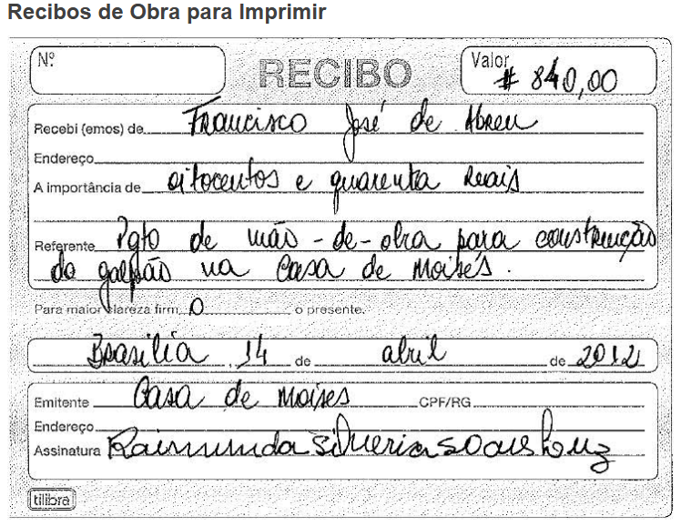

# Extração de Texto de Imagens com Azure AI Vision

## Visão Geral

Este projeto demonstra como utilizar o serviço Azure AI Vision para extrair texto de imagens. O serviço oferece algoritmos avançados para processar imagens e retornar informações, permitindo a extração de texto impresso e/ou manuscrito de imagens e documentos.

## Pré-requisitos

- Assinatura ativa do Microsoft Azure. [https://azure.microsoft.com](https://azure.microsoft.com).
- Recurso: Azure AI Services

## Etapas para Execução

- Acesse o service de vision: [https://portal.vision.cognitive.azure.com](https://portal.vision.cognitive.azure.com).
- Selecione OCR Extrair Textos de Imagens [https://portal.vision.cognitive.azure.com/gallery/ocr](https://portal.vision.cognitive.azure.com/gallery/ocr).

## Extrair Textos de Imagens

- 1 Certifique-se de ter selecionado o recurso Extrair Textos de Imagen.
- 2 Reconheça que o uso da Demo incorrerá com consumo do seu recurso na sua assinatura.
- 3 Caso não tenha um recurso selecionado selecione no link.
- 4 Arrate e solte a imagem.
- 5 Visualização do recurso capturando as informações da imagem.
- 6 e 7 Dados extraidos.

## Conteúdos

### inputs: imagens de entrada para processamento.

### outputs: resultados da extração de texto serão armazenados.

[analise-doc-amostra-1.json](outputs/analise-doc-amostra-1.json)

[analise-doc-amostra-2.json](outputs/analise-doc-amostra-2.json)

[analise-doc-amostra-3.json](outputs/analise-doc-amostra-3.json)

[analise-doc-amostra-4.json](outputs/analise-doc-amostra-4.json)

[analise-doc-amostra-5.json](outputs/analise-doc-amostra-5.json)
